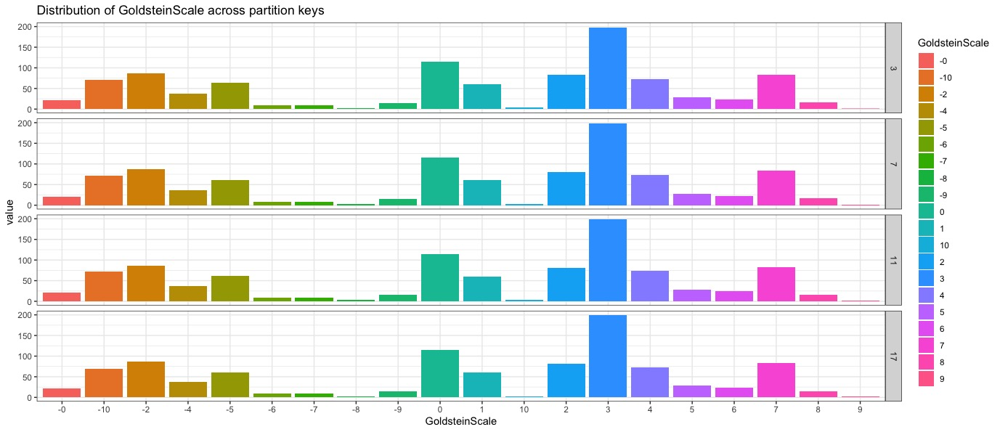

# Kotlin, Coroutines, and the Mongodb Reactivestreams Driver
## Partitioning GDELT Data for further statistical analysis

### This code: 
This code has a simple plan:  
- declare an aggregation  (edit in Compass and export as Java)
- Use a coroutines to read the entire collection in batches and store that field change in a list
- Read the list and submit updates to the database in batches


**Use-case:**  In [The case of mongod and the data analyst](https://mongo-loves-data.medium.com/the-case-of-mongo-and-the-data-analyst-f3ca2f52537d)  I showed how _Spark_ and the <br/>
Mongodb Spark-Connector can be used to populate a database.  The connection from MongoDB to other data tools <br/>
programming environments makes it a very useful.  Is MongoDB better than a RDBMS?  I'll give that a qualified *Yes* <br/>
because of Compass and the Aggregation framework.  Having good tools for developing data queries is one of the things <br/>
that sets MongoDB apart. _And how does that relate to partitioning your data?_  When I had finished uploading all of my <br/>
GDELT files to MongoDB I had a collection with 4M records.  Not _BigData_, but certainly lots of data.  Too much for <br/>
running an analysis with R or Excel, but more importantly using a more manageable slice of data is faster and the initial <br/>
questions about the data are not harmed by having a smaller dataset.  


### Is this a baseless claim?<br/>
For my initial analysis I was looking at AvgTone and the effects of Actor1CountryCode and GoldsteinScale.

AvgTone:  After partitioning and using an aggregation query I looked at the mean AvgTone and it's standard deviation<br/>
  as follows: 
```python
from pymongo import MongoClient
import pandas as pd

client = MongoClient('mongodb://localhost:27017/')
result = client['gdelt']['data'].aggregate([{
  '$match': {
    'Actor1CountryCode': {
      '$exists': 0
    },
    'Actor1CountryCode': {
      '$exists': 1
    },
    'GoldsteinScale': {
      '$exists': 1
    },
    'AvgTone': {
      '$exists': 1
    }
  }
 }, {
   $group': {
     '_id': '$key',
     'count': {
     '$sum': 1
    },
     'avg_tone': {
     '$avg': '$AvgTone'
    },
     'sd_tone': {
     '$stdDevPop': '$AvgTone'
    },
     'avg_scale': {
     '$avg': '$GoldsteinScale'
    },
     'sd_scale': {
     '$stdDevPop': '$GoldsteinScale'
    }
  }
}], allowDiskUse=True)

df = pd.DataFrame(result)
df.to_parquet('gdelt_summary_stats')
df.to_csv( "gdelt_summary.csv")
```

```R
# CHECK BALANCE OF KEYS
keyq = '[
  {
    "$match": {
      "key": {
        "$in": [
          3, 7, 11, 17
        ]
      }, 
      "GoldsteinScale": {
        "$exists": 1
      }
    }
  }, {
    "$project": {
      "key": 1, 
      "GoldsteinScale": {
        "$toString": {
          "$round": [
            "$GoldsteinScale"
          ]
        }
      }
    }
  }
]'
client = mongo( collection="data", db="gdelt", url="mongodb://localhost")
key_data <- client$aggregate(keyq)
key_data %>% filter( is.na(GoldsteinScale) == FALSE) %>% group_by( key, GoldsteinScale ) %>% summarize( value=n(), .groups="rowwise") %>% group_by(key) %>% mutate(key, GoldsteinScale=as.factor(GoldsteinScale), value = round(1000*value/sum(value)) )  %>% as_tibble( colnames="key",rownames="GoldsteinScale", c( GoldsteinScale, value)) %>% ggplot(aes(x=GoldsteinScale, y=value, fill=GoldsteinScale)) + geom_col() ->p 
p + facet_grid(vars(key)) + labs( title="Distribution of GoldsteinScale across partition keys") + theme_bw()

```
